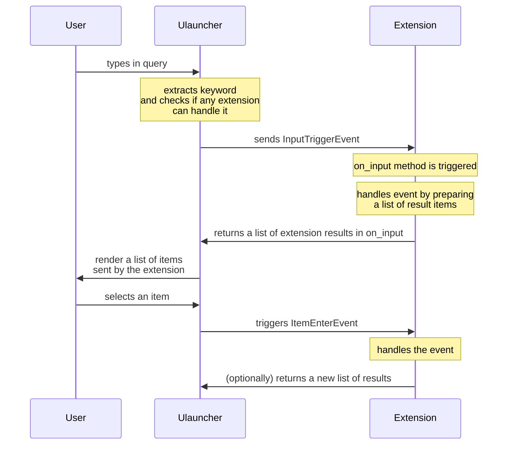

## What is an Extension

Ulauncher extensions are **Python 3** programs that run as separate processes along with the app.

When you run Ulauncher it starts all available extensions so they are ready to react to user events.
All extensions are terminated when Ulauncher app is closed or crashed.

## What Extensions Can Do

Extensions have the same capabilities as any other program --
they can access your directories, make network requests, etc.
Basically they get the same rights as a user that runs Ulauncher.

Extension API v3 (next) enables extension developers to write **custom handlers for keywords**.

*"ti" is a keyword, the rest of the query is an argument in this case.*

With Extension API it is possible to capture event when user enters "ti&lt;Space&gt;" into the input
and then render any results below the input box.

Extensions can define preferences and other settings via `manifest.json`. Users will be able to override them in Ulauncher Preferences window.

It is also possible to capture item click (enter) event and run a custom function to respond to that event.

## What Extensions Cannot Do

They cannot modify behaviour or look of Ulauncher app (see [Color Themes](/themes/) for that).
They can only be used to handle an input that starts with a keyword, which extension developers define in a manifest file.

## Ulauncher ⇄ Extension Communication

Ulauncher implements a client-server architecture. Ulauncher is a server and extensions are clients.

Communication is done using JSON messages over Unix sockets.
For developer convenience there is an abstraction layer (Python classes and functions) available by importing `ulauncher.api` module.
It reduces amount of boilerplate code in extensions.

## Message And Control Flow

The following diagram shows how control over responses to user input is passed between Ulauncher and extensions.

